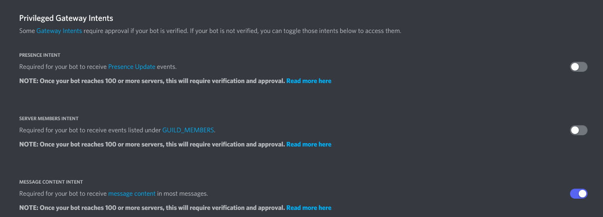

1. Create a new [Application](https://discord.com/developers/applications?new_application=true) at the [Discord Developer Portal](https://discord.com/developers/).

2. Go to "Bot" at the sidebar.

3. In the section "Token" click on "Copy" to copy the token.

4. In the section "Privileged Gateway Intents" enable the "Message Content Intent".

5. Paste the token with ++ctrl+v++ into the SinusBot instance creation form.

6. Add the bot to your discord server by creating an OAuth2 link.
   - To generate it, go to "OAuth2" at the [Discord Developer Portal](https://discord.com/developers/applications), click on "URL Generator" and select the scope "bot".
   - For the permissions, select "Administrator" and click on "Copy" to copy the URL.
   - Open then the generated URL in your browser.
