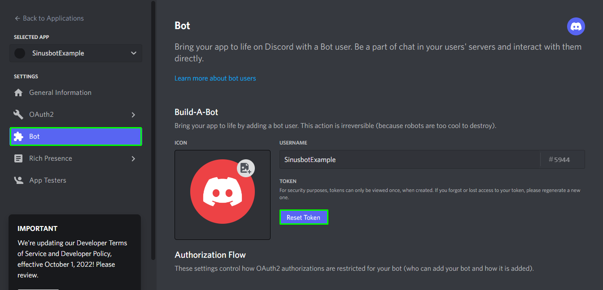
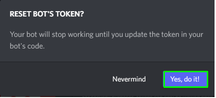

- Create a new [Application](https://discord.com/developers/applications) at the [Discord Developer Portal](https://discord.com/developers/).

- Go to "Bot" at the sidebar and click on "Add Bot".

- In the section "Privileged Gateway Intents" enable the "Message Content Intent".

??? note
    Since a recent update Discord Bot token have to be reset before one can get them! It is no longer possible to display them continuously!

- In the undersection "Token" of section "Bot" click on "Reset Token" then on "Yes, do it!" to reset the token.

- Copy the token

- Paste the token with ++ctrl+v++ into the sinusbot-instance-creation form.

??? info
    Optional: Add the bot to your discord server by creating a OAuth2-link by visiting the page "OAuth2" in the Discord-Developers-sidebar and selecting scope "bot". Open then the provided URL in your browser.