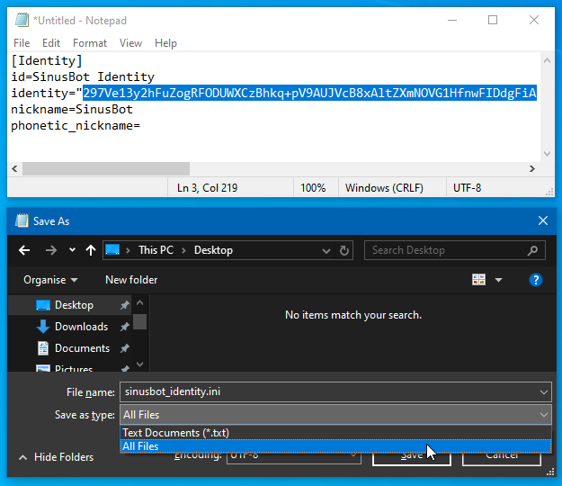
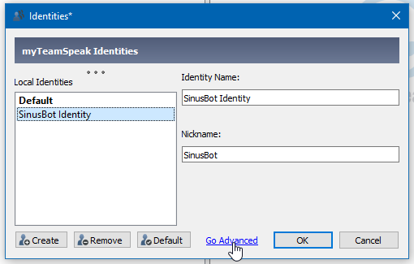
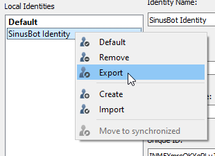
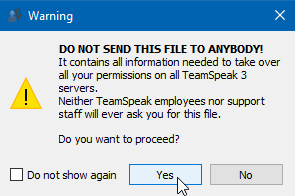
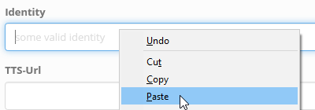

# How to increase TeamSpeak security level

Open your SinusBot web-interface and go to: Settings ⇒ Instance Settings


Click in the text filed labeled "Identity", Select All ++ctrl+a++, Copy ++ctrl+c++


Open a text editor such as notepad and insert the following:

```ini
[Identity]
id=SinusBot Identity 
identity="<IDENTITY_STRING>"
nickname=SinusBot
phonetic_nickname=
```

Replace `<IDENTITY_STRING>` with the identity string you copied (ends with an `=`).

Save the file as `sinusbot_identity.ini` ++ctrl+s++ (select "All Files") on your desktop and close the editor.



Start your TeamSpeak client and open the "Identities" menu ++ctrl+i++


Right-click in the "Local Identities" field and select "Import".


Select the previously created file `sinusbot_identity.ini`.


Click on "Go Advanced" if you are still in the "Basic" mode.



Click on "Improve", then enter your "Requested Security Level" and click on "Start".


When finished click "Close" and then right-click in the SinusBot Identity and select "Export".





Overwrite the previously created file `sinusbot_identity.ini`.


Open the file again and copy the new identity string (ends with an `=`).


Stop your SinusBot instance (the button at the top should be orange/red).


Delete the old identity string ++ctrl+a++ ++del++ and insert the new one ++ctrl+v++.



Now click on "Save changes" to apply your changes. If you followed these steps correctly the new security level will appear.


Now you can start your SinusBot instance again.
