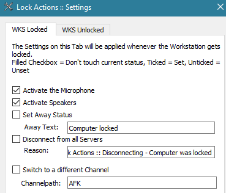

1. Download and install the latest **64-Bit** [TeamSpeak 3 Client](https://teamspeak.com/en/downloads/) for Windows.

2. Download the [SinusBot](https://www.sinusbot.com/#download) Installer for Windows and start it.

3. Optionally you can [install youtube-dl](https://sinusbot.github.io/docs/youtube-dl/) afterwards to allow you to play media from youtube and other supported sites

Be sure that "TeamSpeak 3 Support" is checked, as shown in the following picture:

If the option is not available then the installer could not find a compatible TeamSpeak Client (see step 1).
If you continue installation without this checkbox enabled the SinusBot will only be able to connect to Discord.

## Troubleshooting

Look for any errors in the sinusbot/instance log and try to look-up solutions on our [forum](https://forum.sinusbot.com/) or your favourite search engine.

If you ask us or our community for help then please provide all of the information mentioned in [READ ME BEFORE YOU POST](https://forum.sinusbot.com/threads/read-me-before-you-post.115/).

### I can only connect the SinusBot to Discord, how can I fix it?

As mentioned above: "TeamSpeak 3 Support" needs to be enabled when installing the SinusBot. To fix this you need to:

1. Delete the SinusBot
2. Uninstall old or otherwise uncompatible TeamSpeak Clients.
3. Install a compatible (latest version, 64-Bit) TeamSpeak Client
4. Reinstall the SinusBot as described above

If that's *still* not working then make sure to uninstall any old and 32-Bit TeamSpeak Clients and reinstall the latest 64-Bit TeamSpeak Client in the *default location*.

### bot muted after disconnecting from remote desktop

> The Bot mutes itself after I disconnect from remote desktop. Why? How do I fix it?

That's the fault of the TeamSpeak Client, see [this post](https://forum.teamspeak.com/threads/72927-Not-possible-Microphone-Mutes-on-Computer-Lock) from a TeamSpeak Developer.

There are a few threads about this on our forum:

- \[ENG] [forum.sinusbot.com/threads/5521/#post-32460](https://forum.sinusbot.com/threads/disconnecting-rdp-bot-mutes-it-self.5521/#post-32460)
- \[ENG] [forum.sinusbot.com/threads/2496/](https://forum.sinusbot.com/threads/sinusbot-mutes-itself-on-a-headless-pc-when-not-connected-to-teamviewer.2496/)
- \[GER] [forum.sinusbot.com/threads/6498/#post-36130](https://forum.sinusbot.com/threads/sinusbot-muted-sich-windows-server.6498/#post-36130)
- \[GER] [forum.sinusbot.com/threads/5289/](https://forum.sinusbot.com/threads/sinusbot-mutet-sich.5289/)

There is no official support from TeamSpeak to disable this behavior but there is a [workaround as described in this post](https://forum.sinusbot.com/threads/sinusbot-mutet-sich.5289/page-2#post-33696) (in german):

They've solved this by installing the TS3 plugin "Session Lock Actions" and changing the settings as shown below (set to "ticked" checkbox, not "filled").

